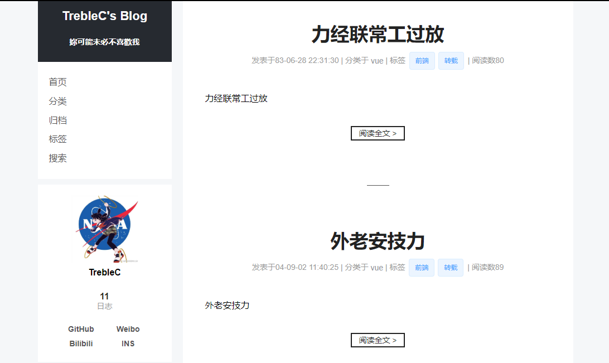
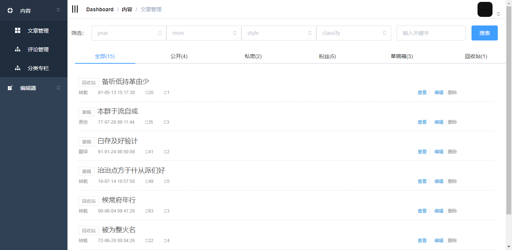
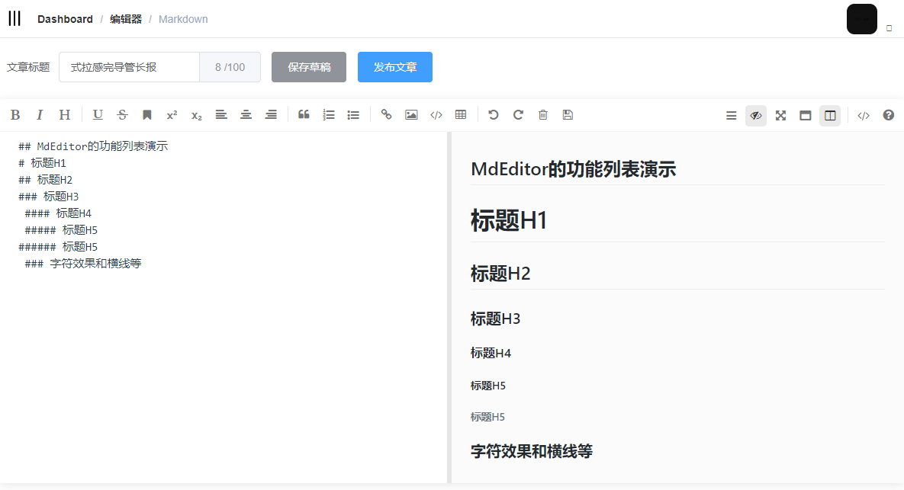

> 一个前端基于Vue2.0全家桶，使用Easy-mock模拟数据的前后端分离博客。前端界面使用了element ui。  
#  特点
* 支持 MarkDown 编辑 ,rich-text

[在线地址](http://47.101.137.152/blog)

# 功能展示展示

#### 主页博客演示

#### 后台管理演示

#### 编辑器

### 前端工具
* Vue
* Vue-Router
* Vuex
* axios
* element ui  
* mavon-editor

mavon-editor教程 [mavon-editor 使用教程](https://blog.csdn.net/qq_31001889/article/details/98210709)

### 后端工具
* easy-mock

使用了非常强大的easymock模拟数据[浅谈easy-mock 最好的备胎没有之一](https://blog.csdn.net/weixin_43254766/article/details/83758660)

前后端的管理界面我直接使用了[element ui](http://element.eleme.io/#/)这个基于vue的组件库，很强大.

Treble

#### 克隆远程库
`git clone https://github.com/TrebleC/vueblogS-C.git`

#### 安装前端依赖
`npm install`

#### 修改config中BASE_API地址
`http://47.101.137.152:7300/mock/5da17f75c6b06e1658b920dc/base`

#### 启动前端项目
`回到项目根目录下运行：npm run dev`

#### 生成发布
`npm run build`

# Todo
* 适应移动端
* 添加评论功能
* 密码修改功能
* 用户权限分类

## License
[MIT](https://github.com/PanJiaChen/vueAdmin-template/blob/master/LICENSE) license.
